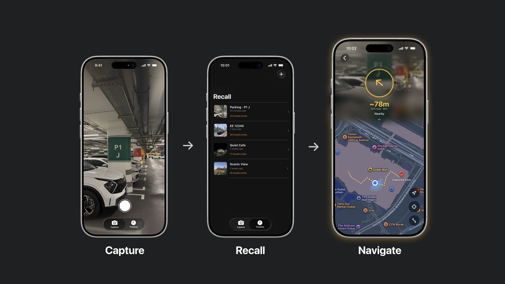

# Recall

Recall is an iOS app that lets you save a memory (photo + location) and navigate back to it later — even under inconsistent GPS conditions.

[Demo Video](https://www.youtube.com/shorts/Bb99dfuGlN4)

## What it does

- Capture a memory with photo + location context
- Persist memories locally on device
- Browse memories in a timeline view
- Navigate back using distance, heading, and a breadcrumb trail
- Maintain usable guidance under weak or noisy GPS

## Tech stack

- SwiftUI
- SwiftData
- CoreLocation
- MapKit
- AVFoundation
- Vision
- ActivityKit (Live Activities)

## Architecture

High-level architecture:

Low-level architecture:

## Key idea
I initially assumed saving a photo, GPS location, and breadcrumb trail would be enough to help someone return to where they left something.

It wasn’t.

Indoor spaces, parking structures, and weak signal areas made it obvious how quickly GPS drift and heading noise break naive navigation. Even breadcrumb trails became unreliable when built directly from raw GPS, causing paths to jump and direction guidance to feel wrong.

## What failed first
My first implementation assumed saving a GPS coordinate and showing distance + bearing would be enough.
In practice, indoor signal drift made this unreliable:
- saved locations could be off by 20–40m
- heading frequently jumped while standing still
- distance often looked correct while direction was wrong

This made “simple navigation” feel broken.
That led to breadcrumb tracking + fallback navigation instead of relying on a single saved coordinate.

## Engineering approach
Instead of relying on a single saved coordinate, Recall adapts navigation in real time by:
- tracking breadcrumb history over time rather than a fixed point
- estimating confidence from GPS consistency and heading stability
- switching navigation behavior when signal quality drops
- using fallback movement estimation during weak/absent GPS windows
- refining guidance when stronger location updates return

## Experiments / Observations
Field and simulation results show navigation quality varies by signal conditions:
- **Stable GPS:** smooth breadcrumb trail and reliable return path in tests.
- **Mixed signal:** usable guidance with occasional drift; recovery improves after stronger updates return.
- **Poor indoor signal:** currently inconsistent in real-world tests; directional guidance may remain usable, but path accuracy can degrade substantially.

Simulation confirms fallback logic behavior, but under-represents indoor multipath/noise. 

Current focus is tuning indoor fallback thresholds using repeated field runs.

## Run locally

1. Open `Recall.xcodeproj` in Xcode.
2. Select an iPhone simulator or real device.
3. Build and run the `Recall` target.

## Current limitations

- Indoor/deep-parking navigation remains less reliable than outdoor routing.
- Simulation performance is currently stronger than real-world indoor performance.
- Vision needs improvements, often captures noise from background text.
- Current focus: tuning fallback thresholds using repeated parking-to-mall field runs.

## Demo video notes

The short demo video is edited for pacing and clarity (cuts, sped-up walking segments with on-screen 2x speed, and minor transition smoothing).  
No core navigation behavior was altered.

Timeline extra entries shown in the demo were curated to quickly illustrate multiple use cases in a short video.

For full context:
- [Edited demo video](https://www.youtube.com/shorts/Bb99dfuGlN4)
- [Unedited capture (privacy-redacted)](https://www.youtube.com/shorts/3luxJZME3o0)

Privacy note: license plates are blurred in the unedited capture.
