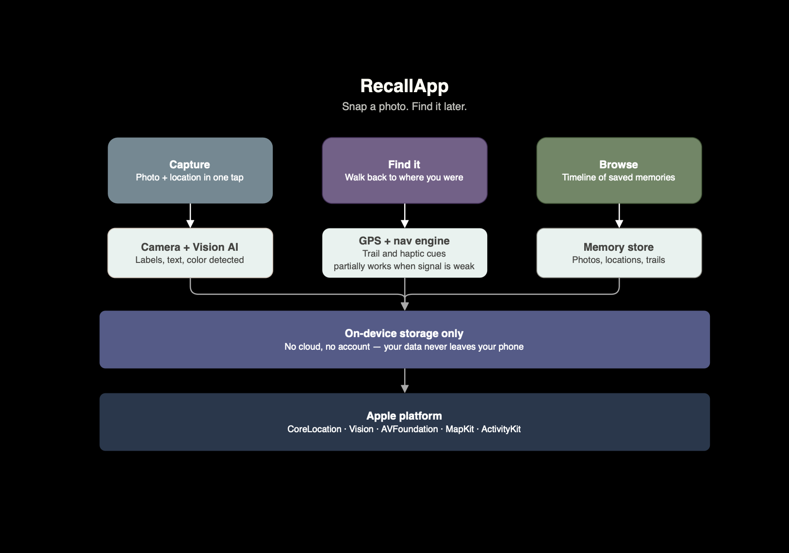
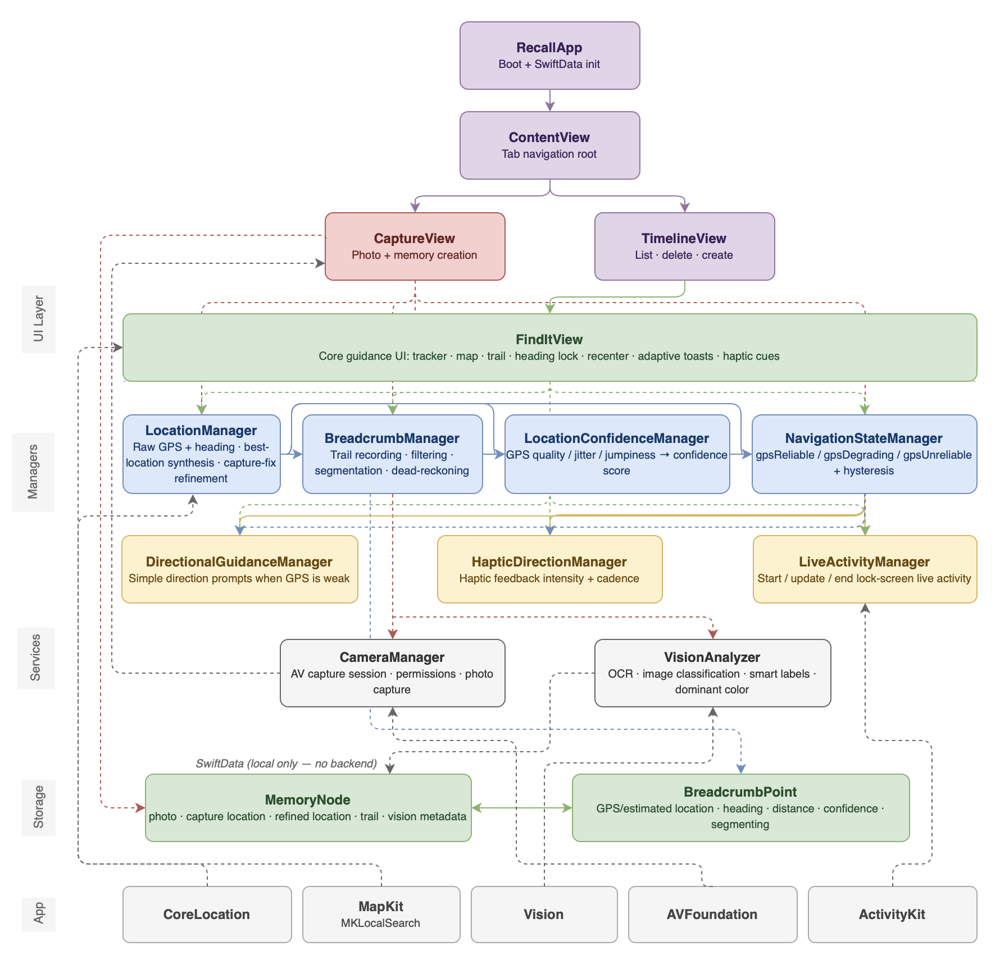

# Recall

Recall is an iOS app that helps you save a memory (photo + location) and find your way back to it later.

## What it does

- Capture a memory with camera and GPS.
- Save memories locally on device.
- Show a timeline of saved memories.
- Guide you back using direction, distance, and map trail.
- Adapt guidance quality when GPS signal is weak.

## Tech stack

- SwiftUI
- SwiftData
- CoreLocation
- MapKit
- AVFoundation
- Vision
- ActivityKit (Live Activities)

## Architecture

High-level architecture diagram:



Low-level architecture diagram:



## Project structure

```text
Recall/
├── docs/
│   └── recall-low-level.png
├── Recall/
│   ├── Models/
│   ├── Helpers/
│   ├── Layers/
│   └── RecallApp.swift
├── RecallWidget/
└── README.md
```

## Run locally

1. Open `Recall.xcodeproj` in Xcode.
2. Select an iPhone simulator or real device.
3. Build and run the `Recall` target.

## Notes

- The app currently uses local persistence (SwiftData), no custom backend.
- Best experience is on a real device (camera, GPS, heading, haptics).
